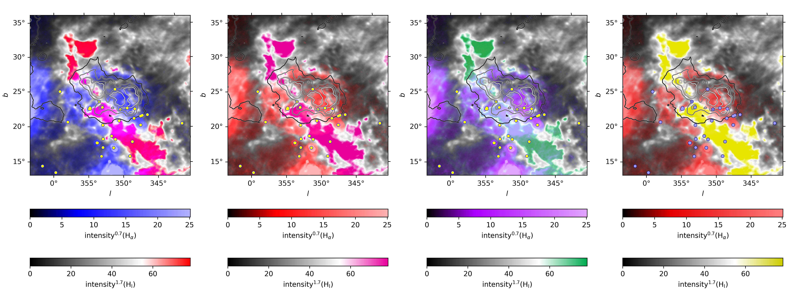

# Sco-Cen-outflow-H-I-filament-sky-map

Based on the data published as part of the below mentioned works. The HI4PI data set was used to display the intensity (scaled, see colour bars) of the neutral hydrogen in this region at -13 km/s. H_alpha is overlayed in the image so that the colour mixes with the colour of the neutral hydrogen map. The dust extinction layers at 107 pc from Edenhofer et al. 2024 are plotted as contours. The small circles identify the stars used for analysing Ca II and K I spectral lines (see PAPER_TO_PUBLISH).

## HI4PI: A full-sky H I survey based on EBHIS and GASS
HI4PI Collaboration, Ben Bekhti, N., Flöer, L., et al. 2016, A&A, 594, A116

## A parsec-scale Galactic 3D dust map out to 1.25 kpc from the Sun
Edenhofer, G., Zucker, C., Frank, P., et al. 2024, A&A, 685, A82

## A Full-Sky H_alpha Template for Microwave Foreground Prediction
Finkbeiner, D. P. 2003, ApJS, 146, 407
